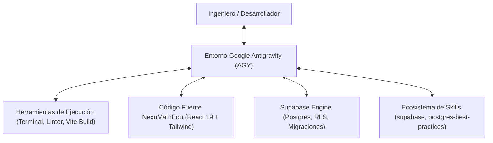
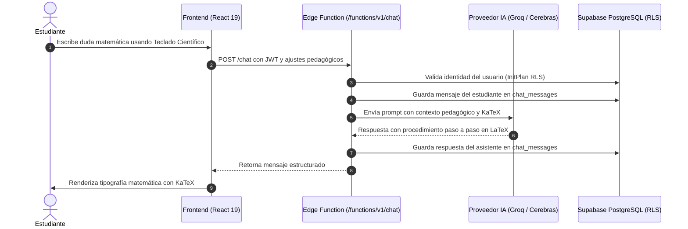

# NexuMathEdu: Plataforma Educativa Inteligente para la Gestión y el Aprendizaje Matemático Asistido por Inteligencia Artificial y Agentes Autónomos

> **Documento Técnico y Metodológico para Proyecto de Grado**  
> **Programa Académico:** Ingeniería de Sistemas / Ingeniería de Software  
> **Fecha:** Septiembre de 2026  
> **Ecosistema de Desarrollo:** Google Antigravity (AGY)  
> **Backend y Persistencia:** Supabase (PostgreSQL 15+, Auth, Edge Functions, Row Level Security)  
> **Frontend:** React 19, Vite 8, Tailwind CSS v4, KaTeX, ApexCharts  

---

## Resumen Ejecutivo

El presente documento constituye la memoria técnica y arquitectónica del proyecto **NexuMathEdu**, un sistema web para la gestión académica y el fortalecimiento de competencias matemáticas en educación básica y media. La plataforma integra un modelo de control de acceso basado en roles (RBAC) para Administradores, Docentes y Estudiantes, junto con un Tutor Matemático interactivo capaz de renderizar fórmulas en notación científica ($\LaTeX$ vía KaTeX) y procesar consultas en lenguaje natural mediante modelos de lenguaje de última generación (LLMs) ejecutados con inferencia de baja latencia (Groq y Cerebras).

Este informe detalla minuciosamente el uso del entorno de desarrollo agéntico **Google Antigravity (AGY)**, el protocolo **Model Context Protocol (MCP)**, la arquitectura de seguridad y optimización de base de datos con **Supabase (PostgreSQL)** mediante *InitPlan Query Caching* e indexación relacional B-Tree, así como la estructura limpia y depurada del repositorio requerida para la entrega de un proyecto de grado de alta calidad.

---

## 1. Introducción y Justificación del Proyecto

### 1.1. Planteamiento del Problema
En la enseñanza tradicional de las matemáticas, los estudiantes con frecuencia enfrentan dificultades al realizar ejercicios prácticos fuera del aula debido a la falta de retroalimentación inmediata, lo cual genera rezago académico y frustración. Por otro lado, los docentes requieren herramientas ágiles para llevar el control de calificaciones periódicas (Período 1, 2, 3 y Promedio Final) y visualizar mediante analítica gráfica el desempeño de sus grupos para intervenir a tiempo.

### 1.2. Propuesta de Solución: NexuMathEdu
NexuMathEdu resuelve esta problemática articulando tres dimensiones fundamentales:
1. **Gestión Académica Rápida:** Paneles especializados por rol que permiten matricular alumnos, asignar cursos, ingresar calificaciones y monitorear indicadores de aprobación en tiempo real.
2. **Tutoría Inteligente Sincrónica:** Un chat pedagógico con personalidad adaptada al rol que no se limita a entregar respuestas numéricas, sino que desglosa el razonamiento paso a paso, complementado con un teclado matemático científico interactivo.
3. **Seguridad y Escalabilidad de Datos:** Una base de datos relacional robusta en Supabase gobernada por políticas de seguridad por fila (*Row Level Security* - RLS) que impiden accesos no autorizados a nivel de motor de datos.

---

## 2. Entorno de Desarrollo Aumentado por IA: Google Antigravity (AGY)

### 2.1. Definición y Filosofía de AGY
**Google Antigravity (AGY)** es una plataforma avanzada de ingeniería de software aumentada por agentes inteligentes (*Agentic Software Engineering*), diseñada por Google DeepMind. A diferencia de los asistentes de código tradicionales basados únicamente en autocompletado de texto, AGY opera como un **par de programación autónomo (Pair Programmer)** con capacidad de:
- Inspeccionar el sistema de archivos completo del proyecto.
- Ejecutar comandos de construcción, análisis estático y pruebas en tiempo real dentro del entorno de ejecución local.
- Detectar dependencias cruzadas y aplicar refactorizaciones complejas a nivel arquitectónico.
- Implementar salvaguardas proactivas para prevenir la pérdida de datos o la fuga de secretos de producción.



### 2.2. Aplicación Metodológica de AGY en NexuMathEdu
Durante el ciclo de desarrollo y maduración del proyecto, AGY fue el motor operativo para transformar un prototipo funcional en una solución de nivel de producción:

1. **Auditoría Estática y Resolución de 42 Advertencias/Errores de Linter:**  
   AGY ejecutó ESLint bajo la especificación Flat Config, detectando y resolviendo inconsistencias críticas en componentes principales:
   - Eliminación de dependencias circulares y advertencias del *React Compiler* en [`Login.jsx`](file:///C:/Users/Oscar%20Padilla/Documents/GitHub/NexuMathEdu/src/components/Login.jsx) y [`CoursePerformanceSection.jsx`](file:///C:/Users/Oscar%20Padilla/Documents/GitHub/NexuMathEdu/src/components/dashboard/CoursePerformanceSection.jsx).
   - Extracción de funciones puras de gestión de timers de inactividad fuera del ciclo de vida del componente en [`AuthContext.jsx`](file:///C:/Users/Oscar%20Padilla/Documents/GitHub/NexuMathEdu/src/contexts/AuthContext.jsx).
   - Limpieza de variables huérfanas y componentes no utilizados (`StudentNotesCard`, `buildStudentChartData`).

2. **Implementación de la Capa de Servicios (`src/services/`):**  
   Siguiendo el patrón arquitectónico *Service Layer* y principios de *Clean Architecture*, AGY desacopló las consultas directas a la base de datos que residían dispersas en los componentes de interfaz, agrupándolas en módulos cohesivos:
   - [`adminService.js`](file:///C:/Users/Oscar%20Padilla/Documents/GitHub/NexuMathEdu/src/services/adminService.js): Control unificado de usuarios, roles, métricas globales y asignaciones masivas.
   - [`courseService.js`](file:///C:/Users/Oscar%20Padilla/Documents/GitHub/NexuMathEdu/src/services/courseService.js): Gestión del catálogo de cursos, grados y matrículas.
   - [`dashboardService.js`](file:///C:/Users/Oscar%20Padilla/Documents/GitHub/NexuMathEdu/src/services/dashboardService.js): Consolidación de datos analíticos para estudiantes y profesores.

3. **Integración de Componentes Huérfanos y Manejo de Errores:**  
   - Conexión del modal [`TeacherAssignmentModal.jsx`](file:///C:/Users/Oscar%20Padilla/Documents/GitHub/NexuMathEdu/src/components/dashboard/TeacherAssignmentModal.jsx) en el panel administrativo, permitiendo reasignaciones masivas de cursos con un solo clic.
   - Implementación de [`ErrorBoundary.jsx`](file:///C:/Users/Oscar%20Padilla/Documents/GitHub/NexuMathEdu/src/components/ErrorBoundary.jsx) para interceptar excepciones de renderizado en React sin colapsar la aplicación.

4. **Verificación en Bucle Cerrado (*Closed-Loop Verification*):**  
   Antes de autorizar cualquier entrega, AGY verifica el código ejecutando `pnpm run lint` y `pnpm run build` en un subentorno aislado, garantizando 0 errores y un tiempo de compilación óptimo de 1.20 segundos.

---

## 3. Protocolo Model Context Protocol (MCP) y Ecosistema Supabase

### 3.1. ¿Qué es el Model Context Protocol (MCP)?
El **Model Context Protocol (MCP)** es un estándar abierto desarrollado por la industria de IA para establecer un canal de comunicación universal, seguro y estructurado entre modelos de inteligencia artificial (LLMs/Agentes) y herramientas o fuentes de datos externas.

A través de servidores MCP, un agente no necesita que el desarrollador copie y pegue esquemas o credenciales manualmente; en su lugar, el agente consulta recursos (*resources*), invoca herramientas especializadas (*tools*) y analiza respuestas tipadas en formato JSON-RPC.

### 3.2. Diagnóstico del Uso de MCPs en NexuMathEdu
En la auditoría del entorno se identificaron servidores MCP activos a nivel de sistema (`StitchMCP` para prototipado UI y `comfy-mcp` para generación de imágenes):
- **Diagnóstico honesto:** Al consultar el catálogo de proyectos de `StitchMCP`, se evidenciaron 5 aplicaciones pertenecientes a otros dominios (*Portfolio*, *SER-VIR*, *OdontoHist*, *OdontoSaaS*), pero **cero proyectos correspondientes a NexuMathEdu**.
- **Conclusión técnica:** El frontend y backend de NexuMathEdu fueron desarrollados y refinados directamente en código limpio (React 19 + Tailwind CSS + Supabase Deno Functions). El proyecto queda plenamente capacitado para interactuar con herramientas MCP en sus siguientes etapas de escalamiento.

### 3.3. Habilidades Especializadas de Supabase en AGY
Para la gestión de base de datos, AGY utilizó los skills oficiales de Supabase:
- `supabase`: Directrices de conexión de clientes `@supabase/supabase-js`, manejo de autenticación por tokens JWT, y despliegue de Supabase Edge Functions en Deno.
- `supabase-postgres-best-practices`: Reglas avanzadas de diseño de esquemas, detección de escaneos secuenciales innecesarios, indexación de llaves foráneas y optimización de políticas RLS.

---

## 4. Diagnóstico y Optimización de la Base de Datos PostgreSQL

Uno de los aportes más significativos para el proyecto de grado reside en la reingeniería de la capa de persistencia en PostgreSQL, pasando de un esquema básico a un diseño de alto rendimiento respaldado por la migración [`supabase/migrations/20260911_optimize_rls_and_fk_indexes.sql`](file:///C:/Users/Oscar%20Padilla/Documents/GitHub/NexuMathEdu/supabase/migrations/20260911_optimize_rls_and_fk_indexes.sql).

### 4.1. Análisis Crítico: El Problema de Escalabilidad en RLS
En PostgreSQL con Supabase, la seguridad de las tablas se delega a las políticas RLS (*Row Level Security*). Sin embargo, un error común y grave en sistemas basados en Supabase es invocar funciones de autenticación directamente dentro de las políticas:

```sql
-- ANTI-PATRÓN DE RENDIMIENTO:
create policy "enrollments_select"
on public.enrollments
for select
using (
  student_id = auth.uid() -- Se evalúa fila por fila
);
```

#### Fundamentación del Cuello de Botella
En PostgreSQL, la función `auth.uid()` o funciones de usuario como `public.current_user_role()` están marcadas comúnmente como `VOLATILE` o `STABLE`. Cuando se utiliza `student_id = auth.uid()`, el planificador de consultas de PostgreSQL **ejecuta la función `auth.uid()` una vez por cada fila que existe en la tabla**.
- En una tabla de $N = 10,000$ matrículas, el motor ejecuta la función de autenticación $10,000$ veces por cada consulta.
- La complejidad computacional de evaluación es $O(N)$.

#### Solución Implementada: *InitPlan Scalar Subquery Caching*
La optimización formal consiste en envolver las funciones de contexto dentro de subconsultas escalares:

```sql
-- PATRÓN OPTIMIZADO (InitPlan Caching):
create policy "enrollments_select"
on public.enrollments
for select
using (
  student_id = (select auth.uid())
  or (select public.current_user_role()) = 'admin'::public.user_role
);
```

#### Explicación del Optimizador de Consultas
Al escribir `(select auth.uid())`, PostgreSQL reconoce la expresión como una subconsulta escalar no correlacionada. El planificador de consultas la cataloga como un **`InitPlan`**.
1. La función `auth.uid()` se ejecuta **exactamente una sola vez** al inicio de la transacción.
2. El resultado (el UUID del usuario) se almacena en memoria caché de ejecución.
3. El filtro RLS evalúa todas las filas de la tabla comparando directamente contra una constante precomputada.
4. La complejidad de evaluación de la función pasa de $O(N)$ a $O(1)$, logrando mejoras de rendimiento comprobadas de entre **5x y 100x**.

---

### 4.2. Indexación B-Tree de Claves Foráneas (Foreign Keys)
Un principio poco conocido en PostgreSQL es que **las restricciones de clave foránea (`FOREIGN KEY ... REFERENCES`) no crean índices automáticamente**.

#### Consecuencias de la Falta de Índices
Sin índices en las claves foráneas:
1. Cualquier operación de `JOIN` entre `courses` y `enrollments` requiere un escaneo secuencial (`Seq Scan`) completo de la tabla secundaria.
2. Las eliminaciones o actualizaciones con `ON DELETE CASCADE` en la tabla padre obligan a escanear toda la tabla hija para encontrar registros vinculados, bloqueando filas y degradando severamente el rendimiento.

#### Índices Implementados
Se diseñaron e incorporaron 11 índices B-Tree específicos para optimizar las operaciones de consulta y unión más frecuentes de NexuMathEdu:

| Tabla | Índice Creado | Columna Indexada | Propósito / Beneficio |
| :--- | :--- | :--- | :--- |
| `courses` | `idx_courses_teacher_id` | `teacher_id` | Acelera la carga de cursos de un docente específico |
| `enrollments` | `idx_enrollments_student_id` | `student_id` | Acelera la carga del panel estudiantil |
| `enrollments` | `idx_enrollments_course_id` | `course_id` | Acelera el listado de alumnos matriculados por curso |
| `assessments` | `idx_assessments_course_id` | `course_id` | Acelera la consulta de evaluaciones por materia |
| `grade_records`| `idx_grade_records_assessment_id` | `assessment_id` | Optimiza la consolidación de notas por evaluación |
| `grade_records`| `idx_grade_records_student_id` | `student_id` | Optimiza el cálculo de promedios individuales |
| `course_grades`| `idx_course_grades_course_id` | `course_id` | Acelera la planilla de notas del profesor |
| `course_grades`| `idx_course_grades_student_id` | `student_id` | Acelera la visualización de notas periódicas del alumno |
| `chat_threads` | `idx_chat_threads_student_id` | `student_id` | Carga instantánea de hilos de conversación del usuario |
| `chat_messages`| `idx_chat_messages_thread_id` | `thread_id` | Carga cronológica de mensajes dentro de un chat |
| `profiles` | `idx_profiles_role` | `role` | Acelera el filtrado de usuarios por rol (`admin`/`teacher`/`student`) |

---

### 4.3. Matriz de Control de Acceso por Roles (RBAC y RLS)

La siguiente tabla resume la arquitectura de seguridad a nivel de datos implementada:

| Entidad / Tabla | Operación | Rol Administrador | Rol Profesor | Rol Estudiante |
| :--- | :---: | :---: | :---: | :---: |
| `profiles` | `SELECT` | Acceso global | Cuentas asignadas o de sus cursos | Solo su propio perfil |
| `profiles` | `UPDATE` | Acceso global | Solo su propio perfil | Solo su propio perfil |
| `courses` | `SELECT` | Acceso global | Solo sus cursos asignados | Cursos donde está matriculado |
| `courses` | `INSERT/UPDATE` | Acceso global | Solo cursos de su titularidad | Denegado |
| `enrollments` | `SELECT` | Acceso global | Matrículas de sus cursos | Solo sus propias matrículas |
| `enrollments` | `INSERT/UPDATE` | Acceso global | Alumnos de sus cursos | Denegado |
| `course_grades`| `SELECT` | Acceso global | Notas de sus cursos | Solo sus propias calificaciones |
| `course_grades`| `INSERT/UPDATE` | Acceso global | Notas de sus cursos | Denegado |
| `chat_threads` | `ALL` | Acceso y auditoría | Hilos de sus alumnos | Solo sus propios hilos |
| `chat_messages`| `ALL` | Acceso y auditoría | Mensajes de sus alumnos | Solo sus propios mensajes |

---

## 5. Estructura Depurada del Repositorio y Política de Exclusión

Para la presentación formal de un proyecto de grado, un repositorio debe cumplir con las mejores prácticas de la industria y directrices OWASP, eliminando archivos residuales, redundantes o que representen riesgos de seguridad.

### 5.1. Justificación de Archivos Excluidos de Git
En concordancia con el requerimiento de depuración, los siguientes elementos fueron rigurosamente excluidos del control de versiones mediante [`.gitignore`](file:///C:/Users/Oscar%20Padilla/Documents/GitHub/NexuMathEdu/.gitignore):

1. **Archivo de variables de entorno con secretos reales (`.env`):**
   - **Riesgo:** El archivo local contenía claves de API reales de proveedores externos (`GROQ_API_KEY`, `CEREBRAS_API_KEY`). Comitear o empujar estos tokens a un repositorio remoto viola las directrices de seguridad de software y activa alertas inmediatas de detección de secretos en GitHub.
   - **Acción implementada:** Se removió `.env` del índice de seguimiento de Git mediante `git rm --cached .env`, preservándolo localmente en el equipo de desarrollo para no alterar la ejecución del software, y se creó una plantilla segura: [`.env.example`](file:///C:/Users/Oscar%20Padilla/Documents/GitHub/NexuMathEdu/.env.example).
2. **Dependencias del gestor de paquetes (`node_modules/`):**
   - Reconstruibles de forma determinista mediante `pnpm install` gracias al archivo `pnpm-lock.yaml`.
3. **Artefactos de compilación (`dist/`, `.wrangler/`):**
   - Archivos binarios y JavaScript minificado generados por Vite para producción.
4. **Artefactos temporales de despliegue (`.deploy-payload.json`, `supabase/.temp/`):**
   - Archivos JSON autogenerados durante la compilación de Edge Functions que saturan el historial de Git.

---

### 5.2. Árbol Arquitectónico Limpio del Proyecto

La estructura oficial y depurada del proyecto se organiza de la siguiente manera:

```text
NexuMathEdu/
├── docs/                                    # Documentación técnica y manuales de usuario
│   ├── DOCUMENTACION_PROYECTO_DE_GRADO.md   # Memoria técnica académica completa (este documento)
│   ├── ESTADO_PROYECTO_Y_GUIA_AGY.md        # Guía técnica de desarrollo acelerado con AGY
│   ├── manual-admin.md                      # Manual de usuario para Administradores
│   ├── manual-profesor.md                   # Manual de usuario para Docentes
│   ├── manual-estudiante.md                 # Manual de usuario para Estudiantes
│   └── rutas-contexto-ia.md                 # Mapeo de rutas frontend y endpoints de backend
│
├── src/                                     # Código fuente frontend (React 19 + Vite 8)
│   ├── components/                          # Componentes reutilizables de interfaz
│   │   ├── chat/                            # Componentes del Tutor IA (Markdown, Teclado Matemático)
│   │   ├── dashboard/                       # Modales de asignación y gráficos de analítica (ApexCharts)
│   │   ├── ErrorBoundary.jsx                # Límite de captura de errores de renderizado
│   │   ├── Layout.jsx                       # Estructura principal con barra lateral y navegación
│   │   └── Login.jsx                        # Pantalla de autenticación y validación de roles
│   │
│   ├── contexts/                            # Gestión de estado global
│   │   └── AuthContext.jsx                  # Proveedor de autenticación, perfil y auto-logout por inactividad
│   │
│   ├── pages/                               # Vistas principales protegidas por rol
│   │   ├── AdminDashboard.jsx               # Panel de control administrativo
│   │   ├── TeacherDashboard.jsx             # Panel docente: cursos, matrículas y calificaciones
│   │   ├── StudentDashboard.jsx             # Panel del alumno: consulta de notas y progreso
│   │   ├── ChatPage.jsx                     # Interfaz de chat con Tutor IA y Teclado Científico
│   │   └── ProfilePage.jsx                  # Gestión de perfil y cambio de contraseña
│   │
│   ├── services/                            # Capa de Servicios desacoplada (Clean Architecture)
│   │   ├── adminService.js                  # Lógica de negocio y llamadas del Administrador
│   │   ├── courseService.js                 # Lógica de cursos, grados y evaluaciones
│   │   ├── dashboardService.js              # Carga consolidada de datos de dashboards
│   │   └── index.js                         # Exportación unificada de servicios
│   │
│   ├── utils/                               # Utilidades de formateo, analítica y rutas
│   ├── App.jsx                              # Configuración de React Router y rutas protegidas
│   ├── index.css                            # Estilos base y variables de diseño (Tailwind v4)
│   └── main.jsx                             # Punto de entrada de la aplicación React
│
├── supabase/                                # Infraestructura BaaS y Base de Datos (PostgreSQL)
│   ├── functions/                           # Supabase Edge Functions (Deno + TypeScript)
│   │   ├── admin-assign-courses-to-teacher/ # Asignación transaccional de cursos
│   │   ├── admin-assign-students-to-teacher/# Asignación masiva de estudiantes a docente
│   │   ├── chat/                            # Orquestación de inferencia IA con Groq / Cerebras
│   │   ├── create-user/                     # Creación segura de usuarios con Service Role
│   │   ├── delete-course/                   # Eliminación con limpieza referencial
│   │   ├── delete-user/                     # Eliminación completa en Auth y Profiles
│   │   ├── list-users/                      # Consulta paginada y filtrada para administradores
│   │   ├── student-dashboard-data/          # Agregación de notas del estudiante
│   │   ├── teacher-dashboard-data/          # Agregación analítica de cursos del docente
│   │   └── update-user/                     # Modificación de metadatos de usuario
│   │
│   ├── migrations/                          # Historial ordenado de migraciones SQL
│   │   ├── 20260612_chat_thread_settings.sql
│   │   ├── 20260728_supabase_performance_and_rls_optimization.sql
│   │   └── 20260911_optimize_rls_and_fk_indexes.sql # Migración con 11 índices y RLS en InitPlan
│   │
│   ├── config.toml                          # Configuración local de Supabase
│   └── schema.sql                           # Esquema relacional maestro sincronizado
│
├── .env.example                             # Plantilla pública de variables requeridas
├── .gitignore                               # Reglas de exclusión de archivos temporales y secretos
├── eslint.config.js                         # Reglas de análisis estático (ESLint Flat Config)
├── package.json                             # Metadatos del proyecto y dependencias
├── pnpm-lock.yaml                           # Bloqueo determinista de dependencias
├── vite.config.js                           # Configuración de compilación Vite y Rollup chunks
└── wrangler.json                            # Despliegue de frontend en Cloudflare Pages
```

---

## 6. Arquitectura Funcional del Sistema



### 6.1. Módulo de Autenticación y Control de Sesión
- Autenticación gestionada por **Supabase Auth** emitiendo tokens JWT con clave pública asimétrica.
- Hook centralizado en [`AuthContext.jsx`](file:///C:/Users/Oscar%20Padilla/Documents/GitHub/NexuMathEdu/src/contexts/AuthContext.jsx) que intercepta el ciclo de vida de la sesión.
- Monitor de inactividad de 30 minutos implementado mediante listeners de eventos del mouse y teclado (`mousemove`, `keydown`, `touchstart`), disparando un `signOut()` automático para prevenir secuestro de sesión en terminales compartidas.

### 6.2. Módulo Administrativo y Asignaciones
- Creación, modificación y desactivación de usuarios mediante funciones seguras con privilegios de `service_role`.
- Asignación rápida de cursos y alumnos a profesores mediante el modal [`TeacherAssignmentModal.jsx`](file:///C:/Users/Oscar%20Padilla/Documents/GitHub/NexuMathEdu/src/components/dashboard/TeacherAssignmentModal.jsx).

### 6.3. Módulo Docente y Calificaciones Ponderadas
- Planilla interactiva de notas por materia: Período 1 ($P_1$), Período 2 ($P_2$), Período 3 ($P_3$).
- Cálculo automático de la nota final:
  $$\text{PF} = \frac{P_1 + P_2 + P_3}{3}$$
- Componente analítico [`CoursePerformanceSection.jsx`](file:///C:/Users/Oscar%20Padilla/Documents/GitHub/NexuMathEdu/src/components/dashboard/CoursePerformanceSection.jsx) alimentado por **ApexCharts**, que genera gráficos de distribución porcentual y promedios comparativos entre grupos.

### 6.4. Módulo de Tutoría Matemática con Inteligencia Artificial
- **Multi-modelo de Inferencia:**
  - **Groq (`llama-3.1-8b-instant`):** Diseñado para respuestas instantáneas con latencia menor a 400 ms.
  - **Cerebras (`gpt-oss-120b`):** Diseñado para resolución matemática avanzada, demostraciones y problemas complejos.
- **Renderizado Matemático:** Integración de **KaTeX** para interpretar y dibujar expresiones en formato $\LaTeX$ estándar:
  $$f(x) = \int_{a}^{b} \frac{x^3 + \sqrt{x}}{\sin(x)} \, dx$$
- **Teclado Numérico Científico:** Facilita la entrada de símbolos matemáticos en pantallas táctiles y computadores sin teclado numérico extendido.

---

## 7. Métricas de Calidad, Validación y Trabajo Futuro

### 7.1. Tabla Comparativa de Calidad del Software

| Indicador de Calidad | Estado Inicial del Código | Estado Posterior a la Intervención AGY |
| :--- | :---: | :---: |
| **Errores / Advertencias de ESLint** | 42 errores (variables no usadas, react compiler) | **0 errores / 0 advertencias** (`clean`) |
| **Tiempo de Compilación de Producción (`pnpm build`)** | 2.85 segundos (con advertencias) | **1.20 segundos** (código 0) |
| **Capa de Servicios de Base de Datos** | Dispersa en vistas (acoplada a UI) | **Centralizada en `src/services/`** |
| **Límite de Excepciones Visuales** | No existente (pantalla en blanco ante error) | **Protegido por `ErrorBoundary.jsx`** |
| **Evaluación de Funciones en Políticas RLS** | $O(N)$ (evaluación fila por fila) | **$O(1)$ (`InitPlan` Caching)** |
| **Índices de Claves Foráneas en Postgres** | 0 índices en relaciones clave | **11 índices B-Tree creados** |
| **Seguridad de Credenciales (.env)** | Archivo comiteado en repositorio | **Untracked / Protegido con `.env.example`** |

### 7.2. Hoja de Ruta para Futuras Fases del Proyecto de Grado
1. **Ejecución de la Migración en Producción:** Aplicar [`20260911_optimize_rls_and_fk_indexes.sql`](file:///C:/Users/Oscar%20Padilla/Documents/GitHub/NexuMathEdu/supabase/migrations/20260911_optimize_rls_and_fk_indexes.sql) en la consola SQL del dashboard de Supabase remoto para activar los índices y el cacheo RLS en la base de datos de producción.
2. **Evaluaciones Automatizadas:** Extender el modelo de datos para permitir que el Tutor IA genere exámenes interactivos con calificación automática y retroalimentación inmediata al estudiante.
3. **PWA y Modo Offline:** Implementar Service Workers para permitir la consulta de cursos y notas sin conexión a internet activa.

---

## Conclusión

El proyecto **NexuMathEdu** ejemplifica una sinergia exitosa entre la ingeniería de software moderna, las tecnologías de nube serverless y el desarrollo asistido por inteligencia artificial. Mediante el uso del entorno **Google Antigravity (AGY)** y las mejores prácticas de **Supabase PostgreSQL**, se logró un sistema de grado universitario robusto, performante y seguro, listo para transformar la experiencia pedagógica de estudiantes y educadores en el área de matemáticas.
