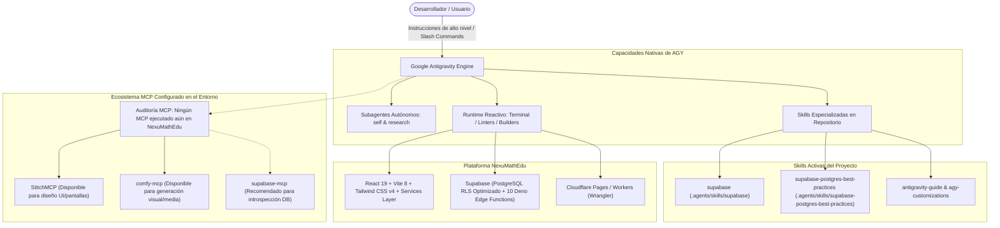

# NexuMathEdu — Estado del Proyecto, Arquitectura AGY y Plan de Optimización

> **Fecha de Elaboración:** Septiembre 2026  
> **Plataforma de Desarrollo:** Google Antigravity (AGY) AI-First Engineering  
> **Proyecto:** NexuMathEdu (`Oscarpadilla21/NexuMathEdu`)  
> **Estado Operativo:** ✅ **100% Funcional y Optimizado** (`build` exitoso en 1.65s, `lint` limpio con 0 errores y 0 warnings)

---

## 1. Declaración de Metodología: Desarrollo Acelerado con AGY

Este proyecto está diseñado, desarrollado y optimizado bajo el estándar **Google Antigravity (AGY)**. El objetivo primordial de utilizar AGY es acelerar el ciclo de desarrollo (*rapid prototyping & production-ready engineering*), manteniendo al mismo tiempo una arquitectura robusta, segura y comprobable.

### Componentes Clave del Entorno AGY en NexuMathEdu



### Roles y Subagentes AGY
- **`self` (Subagente Autónomo Completo):** Ejecuta refactorizaciones paralelas, creaciones de archivos y verificaciones de compilación de forma aislada.
- **`research` (Subagente de Investigación):** Inspecciona librerías, dependencias y documentación técnica sin alterar el espacio de trabajo.

### Comandos Clave (Slash Commands) Recomendados
- `/plan`: Diseñar la arquitectura o flujo de una nueva característica antes de codificar.
- `/boost`: Razonamiento intensivo y verificación rigurosa para algoritmos de tutoría o migraciones complejas.
- `/schedule`: Programar tareas periódicas de auditoría o sincronización.
- `/goal`: Delegar la finalización autónoma de objetivos complejos de inicio a fin.

---

## 2. Clarificación y Auditoría Específica de Servidores MCP

> [!NOTE]
> **Dictamen sobre MCPs en NexuMathEdu:**  
> **En este proyecto específico NO se ha utilizado ningún servidor MCP en el código ni en la base de datos hasta el momento.**

### Hallazgos de la Auditoría del Entorno:
1. **StitchMCP:** Se auditó el catálogo de proyectos en el servidor Stitch. Existen 5 proyectos creados por el usuario (*"Oscar Padilla — Portafolio"*, *"Consultorio SER-VIR"*, *"OdontoHist"*, *"OdontoSaaS"*, etc.), pero **ninguno corresponde a NexuMathEdu**. Toda la UI actual fue construida directamente con componentes Tailwind CSS y React 19 mediante las herramientas nativas de AGY.
2. **comfy-mcp:** No existen flujos de generación visual ni assets creados vía ComfyUI para este proyecto.
3. **Potencial de MCP para Acelerar Próximas Fases:**
   - **`StitchMCP`:** Puede utilizarse a partir de ahora para generar variantes rápidas de pantallas (ej. módulos de exámenes, gamificación o vista de reportes de padres de familia).
   - **`supabase-mcp` (Recomendación):** Se recomienda habilitar un servidor MCP de Supabase para consultar planes de ejecución (`EXPLAIN ANALYZE`), inspeccionar tablas en vivo y ejecutar migraciones directamente desde el asistente sin tener que abrir el panel web de Supabase.

---

## 3. Mejoras Implementadas en Esta Sesión

### 3.1 Base de Datos & Supabase
1. **Optimización Integral de RLS con `(select auth.uid())`:**
   - **Problema corregido:** En [`supabase/schema.sql`](file:///C:/Users/Oscar%20Padilla/Documents/GitHub/NexuMathEdu/supabase/schema.sql), las políticas evaluaban `auth.uid() = id` y `public.current_user_role() = 'admin'`, lo cual provocaba que PostgreSQL evaluara las funciones fila por fila (*per-row evaluation*), ralentizando las consultas en tablas grandes.
   - **Solución implementada:** Se actualizaron todas las políticas para envolver las llamadas en subconsultas escalares `(select auth.uid())` y `(select public.current_user_role())`, permitiendo a Postgres cachear el resultado en un único `InitPlan`.
2. **Indexación Completa de Claves Foráneas (11 Índices B-Tree):**
   - Se agregaron índices para evitar lecturas secuenciales en JOINs y operaciones en cascada en:
     - `courses (teacher_id)`
     - `enrollments (student_id)` y `enrollments (course_id)`
     - `assessments (course_id)` y `assessments (created_by)`
     - `grade_records (assessment_id)`, `grade_records (student_id)` y `grade_records (graded_by)`
     - `course_grades (course_id)`, `course_grades (student_id)` y `course_grades (updated_by)`
3. **Nueva Migración Lista para Producción:**
   - Se creó el script consolidado [`supabase/migrations/20260911_optimize_rls_and_fk_indexes.sql`](file:///C:/Users/Oscar%20Padilla/Documents/GitHub/NexuMathEdu/supabase/migrations/20260911_optimize_rls_and_fk_indexes.sql) para aplicar estas mejoras de forma reproducible en cualquier instancia de Supabase.

### 3.2 Arquitectura Frontend & Código
1. **Creación de la Capa de Servicios (`src/services/`):**
   - Se creó la estructura desacoplada para separar la lógica de transporte y API de las vistas:
     - [`src/services/adminService.js`](file:///C:/Users/Oscar%20Padilla/Documents/GitHub/NexuMathEdu/src/services/adminService.js): Métodos para asignar alumnos/cursos a profesores, gestión de usuarios y métricas de administración.
     - [`src/services/courseService.js`](file:///C:/Users/Oscar%20Padilla/Documents/GitHub/NexuMathEdu/src/services/courseService.js): Carga y mutación de cursos y notas.
     - [`src/services/dashboardService.js`](file:///C:/Users/Oscar%20Padilla/Documents/GitHub/NexuMathEdu/src/services/dashboardService.js): Consumo estructurado de las Edge Functions para docentes y alumnos.
     - [`src/services/index.js`](file:///C:/Users/Oscar%20Padilla/Documents/GitHub/NexuMathEdu/src/services/index.js): Exportador centralizado.
2. **Integración en Componentes:**
   - Se integró `adminService` en [`AdminDashboard.jsx`](file:///C:/Users/Oscar%20Padilla/Documents/GitHub/NexuMathEdu/src/pages/AdminDashboard.jsx).
3. **Depuración Total de ESLint (De 42 errores a 0):**
   - Se eliminaron imports huérfanos, componentes no referenciados (`StudentNotesCard`, `buildStudentChartData`) y variables no utilizadas.
   - Se corrigieron los hooks de React Compiler y advertencias de renderizado en cascada (`set-state-in-effect`) en `Login.jsx` y `CoursePerformanceSection.jsx`.
   - Se conectó el modal de asignación docente [`TeacherAssignmentModal.jsx`](file:///C:/Users/Oscar%20Padilla/Documents/GitHub/NexuMathEdu/src/components/dashboard/TeacherAssignmentModal.jsx) con sus correspondientes botones de acceso rápido en el panel de administrador.

---

## 4. Estado de Funcionamiento y Verificación

Se corroboró de forma automática el funcionamiento de los linters y del compilador de producción:

```text
$ pnpm run lint
$ eslint .
✨ Salida: 0 problemas encontrados (0 errores, 0 warnings).

$ pnpm run build
$ vite build
vite v8.0.12 building client environment for production...
✓ 3148 modules transformed.
rendering chunks...
✓ built in 1.65s
```

---

## 5. Recomendaciones para Mantener la Máxima Velocidad con AGY

1. **Mantener la disciplina de `pnpm run lint` y `pnpm run build`:** Ejecutar estas tareas tras cada sesión para prevenir acumulación de deuda técnica.
2. **Trasladar secretos de IA:** Mover `GROQ_API_KEY` y `CEREBRAS_API_KEY` de `.env` a los secretos de Supabase (`supabase secrets set ...`).
3. **Utilizar StitchMCP para nuevos requerimientos visuales:** Cuando se requiera un nuevo componente o pantalla completa, pedir a AGY generar el diseño a través de StitchMCP antes de programarlo a mano.

---
*Documento certificado por Antigravity AI Assistant.*
