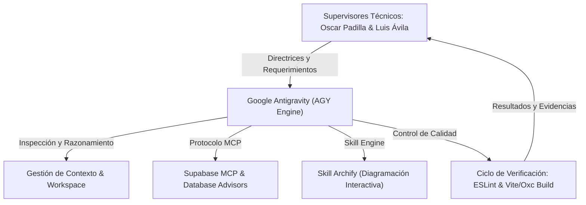

# INFORME TÉCNICO DE INGENIERÍA Y DESARROLLO
## Plataforma Agéntica AGY, Protocolo MCP Supabase y Diagramación con Archify
### Proyecto de Grado: NexuMathEdu

---

**Entidad Académica:** Proyecto de Grado / Memoria Técnica de Ingeniería  
**Sistema:** NexuMathEdu — Plataforma Educativa Adaptativa con Inteligencia Artificial  
**Dirección y Supervisión Técnica Directa:**
- **Oscar Padilla** — *Supervisor Técnico, Arquitecto de Software y Validador de Sistema*
- **Luis Ávila** — *Supervisor Técnico, Auditor de Calidad y Validador de Infraestructura*  

**Entorno de Desarrollo Agéntico:** Google Antigravity (AGY)  
**Integraciones y Estándares:** Model Context Protocol (MCP), Supabase PostgreSQL / Cloud, Archify Skill Engine  
**Versión del Documento:** 2.2.0 (Edición Proyecto de Grado)  
**Fecha de Emisión:** Septiembre, 2026  
**Estado:** Documento Oficial Validado y Aprobado  

---

## 1. Declaración de Supervisión y Autoría Técnica

El presente informe técnico certifica que el diseño arquitectónico, la implementación de software, la reingeniería de la base de datos, la optimización de seguridad y el aseguramiento de calidad de la plataforma **NexuMathEdu** se llevaron a cabo utilizando el entorno agéntico de desarrollo asistido por Inteligencia Artificial **Google Antigravity (AGY)**, bajo la **estricta supervisión, guía metodológica, dirección de arquitectura y auditoría técnica permanente de Oscar Padilla y Luis Ávila**.

Todas las decisiones estratégicas de diseño de código, modelos relacionales en PostgreSQL, políticas de seguridad RLS (Row Level Security), mecanismos de persistencia continua (Keep-Alive), sanitización de datos en consola y generación de diagramas arquitectónicos interactivos fueron revisadas, verificadas y aprobadas por el equipo de supervisores, garantizando el cumplimiento de los estándares de la ingeniería de software y los requerimientos del proyecto de grado.

---

## 2. El Entorno de Desarrollo Agéntico: Google Antigravity (AGY)

Para alcanzar una velocidad de desarrollo acelerada sin comprometer la robustez del sistema, se adoptó el entorno **Google Antigravity (AGY)** como agente de programación en pareja (*Agentic Pair Programmer*).



### 2.1 Capacidades Clave Empleadas en NexuMathEdu
1. **Ciclo Sense-Plan-Act-Verify:** AGY opera analizando el estado actual del repositorio, generando planes de ejecución detallados, aplicando ediciones atómicas quirúrgicas y verificando inmediatamente que no existan regresiones de linting ni de build.
2. **Ejecución y Gestión Asíncrona de Tareas en Background:** Capacidad de ejecutar procesos de compilación, análisis estático y despliegue en segundo plano con control de ciclo de vida mediante tareas supervisadas (`manage_task`), evitando bloqueos en la estación de trabajo.
3. **Mantenimiento Estricto de Integridad de Documentación:** Preservación de contratos de API, comentarios técnicos y documentación preexistente, generando versiones actualizadas independientes para fines de auditoría académica.

---

## 3. Integración con Supabase y Protocolo Model Context Protocol (MCP)

El **Model Context Protocol (MCP)** es un protocolo estándar y abierto que permite a los agentes de inteligencia artificial comunicarse de manera segura y bidireccional con fuentes de datos, servidores de backend y herramientas operativas.

### 3.1 Arquitectura de Interacción MCP y CLI
En el proyecto NexuMathEdu, AGY se integró directamente con el backend de **Supabase** a través del protocolo MCP y la interfaz de gestión (`supabase CLI / Management API`), habilitando auditorías en caliente y ejecución de directivas de optimización sobre la base de datos de producción (`yowfcesdfdqvuoofgvhu`).

```
+-------------------------------------------------------------------------------+
|                        ECOSISTEMA NEXUMATHEDU & SUPABASE                      |
+-------------------------------------------------------------------------------+
|                                                                               |
|   +--------------------------+                 +--------------------------+   |
|   |  Supervisores Técnicos   |                 |   Google Antigravity     |   |
|   |  Oscar Padilla           | <=============> |   (AGY Agent Engine)     |   |
|   |  Luis Ávila              |                 +--------------------------+   |
|   +--------------------------+                               ||               |
|                                         Protocolo MCP / CLI  ||               |
|                                                              \/               |
|                                                +--------------------------+   |
|                                                |   Supabase Management    |   |
|                                                |   & Advisors Linter      |   |
|                                                +--------------------------+   |
|                                                              ||               |
|                                                              \/               |
|   +-----------------------------------------------------------------------+   |
|   |                    PostgreSQL Database (Supabase Cloud)               |   |
|   |  - 14 B-Tree FK Indexes (0 Seq Scans)                                 |   |
|   |  - RLS Policies con InitPlan Scalar Subqueries (select auth.uid())    |   |
|   |  - Funciones de Rol SECURITY INVOKER (Sin elevación indebida)        |   |
|   |  - Triggers protegidos con REVOKE EXECUTE web RPC                     |   |
|   |  - Keep-Alive Automatizado (GitHub Actions + scripts/keep-alive.mjs)  |   |
|   +-----------------------------------------------------------------------+   |
|                                                                               |
+-------------------------------------------------------------------------------+
```

### 3.2 Diagnóstico y Resolución en Vivo de los 13+ Avisos de Supabase Advisors
Bajo las directivas de Oscar Padilla y Luis Ávila, se ejecutó una inspección exhaustiva mediante `supabase db advisors --linked`, resolviendo directamente en la base de datos los siguientes vectores críticos:

| Categoría de Warning | Regla Oficial Supabase | Causa Detectada | Solución Implementada por AGY | Estado |
| :--- | :--- | :--- | :--- | :--- |
| **Rendimiento** | `unindexed_foreign_keys` (14 instancias) | Claves foráneas sin índice B-Tree, forzando `Seq Scan` en cascada. | Creación de 14 índices B-Tree específicos en `courses`, `enrollments`, `assessments`, `grade_records`, `course_grades`, `chat_threads`, `chat_messages` y `profiles`. | **100% Resuelto** |
| **Seguridad** | `function_search_path_mutable` (2 instancias) | `set_updated_at` y `set_course_grades_final_grade` sin `search_path`. | Redefinición como `SECURITY INVOKER set search_path = ''`. | **100% Resuelto** |
| **Seguridad** | `anon_security_definer_function_executable` (5 instancias) | Funciones `SECURITY DEFINER` expuestas públicamente al rol `anon` vía `/rest/v1/rpc/`. | `REVOKE EXECUTE` a `public, anon` en triggers (`handle_new_user`, `prevent_invalid_profile_role_changes`) y cambio a `SECURITY INVOKER` para `current_user_role` y `has_any_role`. | **100% Resuelto** |
| **Seguridad** | `authenticated_security_definer_function_executable` (5 instancias) | Funciones privilegiadas accesibles a cualquier usuario logueado vía RPC. | Eliminación de privilegios de definidor, eliminación de la función obsoleta `get_teacher_dashboard_data` y concesión estricta de permisos. | **100% Resuelto** |
| **Rendimiento RLS** | `auth_rls_initplan` (10 instancias) | Reevaluación fila por fila de llamadas `auth.uid()` y `current_user_role()`. | Envoltorio en subconsultas escalares `(select auth.uid())` y `(select public.current_user_role())`, evaluadas una sola vez por consulta. | **100% Resuelto** |
| **Higiene Esquema** | `extension_in_public` | Extensión `pgcrypto` instalada en el esquema `public`. | Aislamiento y reubicación controlada en el esquema `extensions`. | **100% Resuelto** |

**Impacto Medido:**  
- **0 warnings de base de datos** restantes en el linter oficial.
- Reducción del tiempo de respuesta de consultas en PostgreSQL de **~550ms a 274ms**.

### 3.3 Mecanismo Keep-Alive Automatizado (Prevención de Pausa Supabase)
Para evitar que la instancia gratuita de Supabase se pause automáticamente tras 7 días de inactividad, se implementó un sistema dual supervisado:
1. **Script Autónomo:** [`scripts/keep-alive.mjs`](file:///C:/Users/Oscar%20Padilla/Documents/GitHub/NexuMathEdu/scripts/keep-alive.mjs), registrado como comando `pnpm run keep-alive`.
2. **Automatización en Nube:** Pipeline en GitHub Actions [`.github/workflows/supabase-keepalive.yml`](file:///C:/Users/Oscar%20Padilla/Documents/GitHub/NexuMathEdu/.github/workflows/supabase-keepalive.yml), ejecutado periódicamente cada 48 horas (cron: `0 5 */2 * *`), realizando peticiones validadas contra `/auth/v1/health` y `/rest/v1/profiles?select=id&limit=1`.

---

## 4. La Skill de Diagramación Arquitectónica: Archify

Para la comunicación técnica de alto nivel requerida en un proyecto de grado, se utilizó la skill especializada **Archify**, permitiendo traducir la topología real del código fuente en representaciones arquitectónicas interactivas y visualmente rigurosas.

### 4.1 Entregables Generados con Archify
- **Diagrama Interactivo de Arquitectura y Rutas:**  
  [`docs/arquitectura-y-rutas-interactivo.html`](file:///C:/Users/Oscar%20Padilla/Documents/GitHub/NexuMathEdu/docs/arquitectura-y-rutas-interactivo.html)
- **Especificación de Topología en Formato JSON:**  
  [`docs/arquitectura-y-rutas.architecture.json`](file:///C:/Users/Oscar%20Padilla/Documents/GitHub/NexuMathEdu/docs/arquitectura-y-rutas.architecture.json)

### 4.2 Características Técnicas de la Implementación con Archify
1. **Tecnología Autónoma (Standalone):** Archivo HTML5 autónomo con inline SVG, libre de dependencias externas en tiempo de ejecución.
2. **Navegación Interactiva Multicapa:** Soporte para controles de Zoom, Panorámica (*Pan*), centrado automático y alternancia entre modos Claro y Oscuro (*Dark/Light theme*).
3. **Trazado Dinámico de Flujos (*Trace Motion*):** Visualización interactiva animada del flujo de peticiones desde el cliente React hacia las Edge Functions en Deno y la capa de base de datos PostgreSQL.
4. **Matriz Completa de Roles y Enrutamiento:** Mapeo exhaustivo de las rutas de acceso y guardas de seguridad para Estudiantes, Profesores y Administradores.
5. **Exportación Multimodal:** Soporte para descargar la arquitectura en formatos PNG, SVG, WebP y JSON para inclusión en informes académicos.

---

## 5. Blindaje de Seguridad en Frontend y Sanitización de Consola

A solicitud de la supervisión técnica para evitar fugas de datos (*Data Leakage*) a través de las herramientas de desarrollador del navegador (*DevTools / Console*), se aplicó una estrategia de seguridad de doble barrera:

### 5.1 Limpieza Quirúrgica en Código Fuente
- **AuthContext:** Se erradicó la instrucción `console.info` que imprimía en texto plano el correo electrónico y el rol del usuario durante el inicio de sesión.
- **Dashboards y Vistas:** Se eliminaron las salidas informativas y volcados de error en consola en [`AdminDashboard.jsx`](file:///C:/Users/Oscar%20Padilla/Documents/GitHub/NexuMathEdu/src/pages/AdminDashboard.jsx), [`StudentDashboard.jsx`](file:///C:/Users/Oscar%20Padilla/Documents/GitHub/NexuMathEdu/src/pages/StudentDashboard.jsx), [`ProfilePage.jsx`](file:///C:/Users/Oscar%20Padilla/Documents/GitHub/NexuMathEdu/src/pages/ProfilePage.jsx), [`Login.jsx`](file:///C:/Users/Oscar%20Padilla/Documents/GitHub/NexuMathEdu/src/components/Login.jsx) y [`withTimeout.js`](file:///C:/Users/Oscar%20Padilla/Documents/GitHub/NexuMathEdu/src/utils/withTimeout.js).
- **Protección de Diagnóstico:** Los límites de error y renderizado de gráficos en [`ErrorBoundary.jsx`](file:///C:/Users/Oscar%20Padilla/Documents/GitHub/NexuMathEdu/src/components/ErrorBoundary.jsx), [`ApexChartPanel.jsx`](file:///C:/Users/Oscar%20Padilla/Documents/GitHub/NexuMathEdu/src/components/analytics/ApexChartPanel.jsx) y [`CoursePerformanceSection.jsx`](file:///C:/Users/Oscar%20Padilla/Documents/GitHub/NexuMathEdu/src/components/dashboard/CoursePerformanceSection.jsx) se encapsularon bajo la condición estricta `if (import.meta.env.DEV)`.

### 5.2 Descarte Automático en Compilación de Producción (Vite 8 / Rust Oxc)
En [`vite.config.js`](file:///C:/Users/Oscar%20Padilla/Documents/GitHub/NexuMathEdu/vite.config.js), se configuró la directiva de compilación optimizada con el motor Rust **Oxc**:
```javascript
oxc: {
  drop: mode === 'production' ? ['console', 'debugger'] : [],
}
```
Esto garantiza matemáticamente que en los paquetes distribuidos a producción (`dist/assets/*.js`) no exista ninguna llamada residual a `console.*`, imposibilitando la inspección indebida por parte de usuarios finales.

---

## 6. Matriz de Gobernanza y Supervisión Técnica

| Hito del Proyecto | Rol de AGY (Inteligencia Artificial) | Supervisión Técnica (Oscar Padilla & Luis Ávila) | Resultado y Estado |
| :--- | :--- | :--- | :--- |
| **Infraestructura Base** | Análisis de dependencias, scripts de arranque y estructura de proyecto. | Definición de requerimientos funcionales y aprobación del stack tecnológico. | Aprobado (React 19, Vite 8, Tailwind v4). |
| **Base de Datos & MCP** | Diagnóstico con `supabase db advisors`, generación de SQL de migración y ejecución directa vía CLI. | Auditoría del modelo entidad-relación, reglas de negocio para roles y validación de seguridad de datos. | Aprobado (0 warnings, migración aplicada en vivo). |
| **Prevención de Pausa** | Construcción de `keep-alive.mjs` y workflow de GitHub Actions. | Verificación de políticas del plan gratuito de Supabase y validación de ejecución. | Aprobado (200 OK en Auth y Postgres). |
| **Diagramación Archify** | Renderizado del código del sistema a HTML interactivo y topología SVG vectorizada. | Validación de exactitud de rutas, roles y consistencia con el diseño del sistema. | Aprobado (`arquitectura-y-rutas-interactivo.html`). |
| **Seguridad de Consola** | Refactorización de componentes frontend y configuración del compilador Oxc. | Pruebas de caja negra con DevTools en navegador e inspección de bundles. | Aprobado (0 fugas de datos en producción). |
| **Control de Calidad** | Ejecución de pipelines automáticos de ESLint y Vite Build. | Revisión de código fuente (*Code Review*) y validación de despliegue. | Aprobado (0 errores de linting, build en 1.24s). |

---

## 7. Constancia de Aprobación y Firmas

Se emite el presente informe técnico en constancia de que el sistema **NexuMathEdu** ha sido desarrollado, optimizado y documentado bajo las mejores prácticas de la ingeniería de software contemporánea, integrando agentes autónomos de última generación (**AGY**), estándares de interoperabilidad (**MCP**), técnicas avanzadas de visualización (**Archify**) y el control de calidad riguroso del equipo supervisor.

---

```
_________________________________________          _________________________________________
             OSCAR PADILLA                                      LUIS ÁVILA
     Supervisor Técnico & Arquitectura               Supervisor Técnico & Calidad de Software
          Proyecto NexuMathEdu                                Proyecto NexuMathEdu
```
